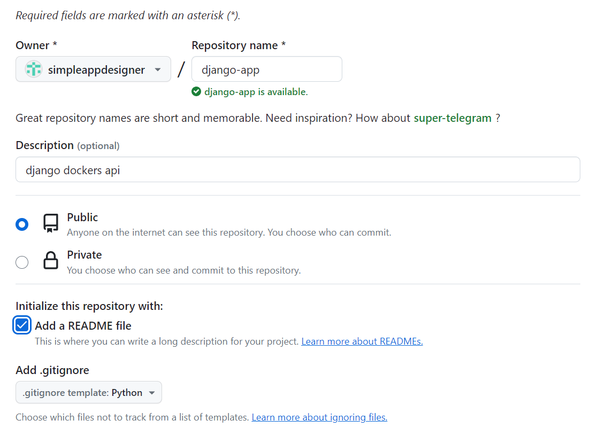
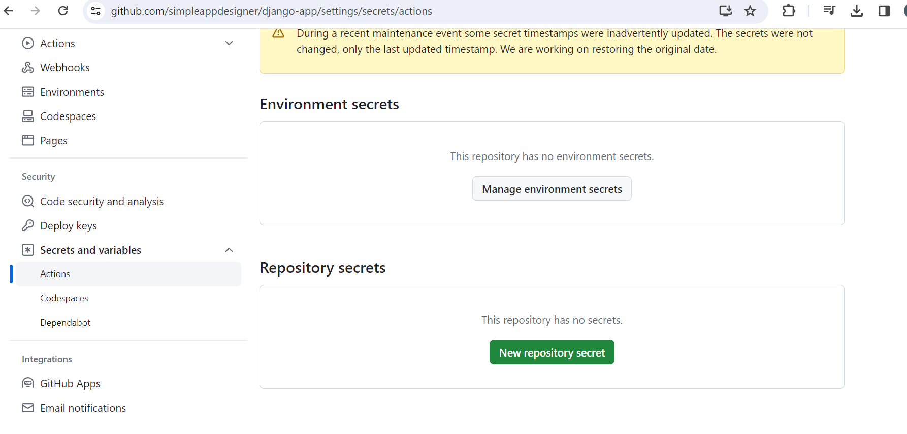

Installation of docker in windows
- open powershell
- install linux `wsl --install -d Ubuntu-20.04`
- `wsl --set-default-version 2 wsl --set-version Ubuntu-20.04 2`
- ` wsl --list --verbose`
- install dockers desktop for windows
- open the app

Github
- create a repo `django-app`

dockers 
-   create access token - profile--> security access token 
- go github , new repository secret 

create dockerfile and .dockerignore

add flake8 to dependencies and dockerfile

`docker-compose run -rm app sh -c "flake8"`

1. create project folder `docker-compose run --rm app sh -c "django-admin startproject app ."`
2. `docker-compose up`
3. browse at http://localhost:8000/

## Docker-compose key commands
- `docker-compose up`
- `docker-compose -f /path/to/docker-compose.yml up`
- `docker-compose up -d` # run in detached mode
- `docker-compose down`

## Docker key commands
- `docker exec -it <container_name_or_id> /bin/sh` interactively and `exit` to come out.
- `docker inspect IMAGE_ID` 

